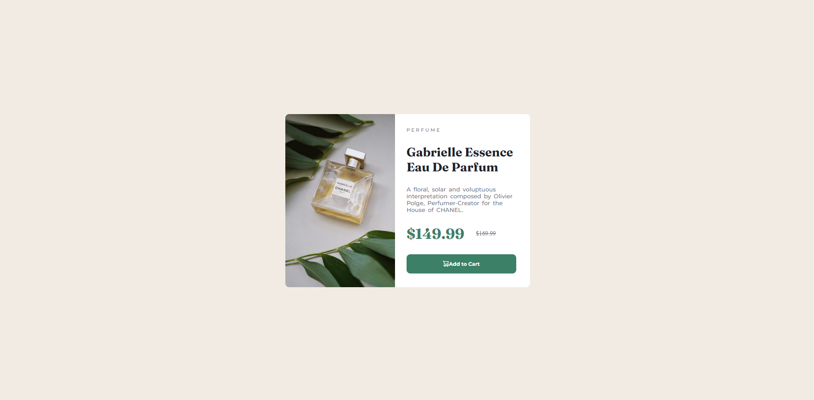
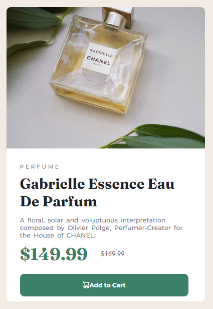

# Frontend Mentor - Product preview card component solution

This is a solution to the [Product preview card component challenge on Frontend Mentor](https://www.frontendmentor.io/challenges/product-preview-card-component-GO7UmttRfa). Frontend Mentor challenges help you improve your coding skills by building realistic projects. 

## Table of contents

- [Overview](#overview)
  - [The challenge](#the-challenge)
  - [Screenshot](#screenshot)
  - [Links](#links)
- [My process](#my-process)
  - [Built with](#built-with)
  - [What I learned](#what-i-learned)
  - [Continued development](#continued-development)
  - [Useful resources](#useful-resources)
- [Author](#author)
- [Acknowledgments](#acknowledgments)

## Overview

I successfully completed this Frontend Mentor challenge on the 5/12/22. There are several improvements that could be made in terms of optimisation though I am very happy with the visual output produced by my solution.

### The challenge

Users should be able to:

- View the optimal layout depending on their device's screen size
- See hover and focus states for interactive elements

### Screenshot




### Links

- Solution URL: [GitHub - FrontEndMentorProductPreviewCard](https://github.com/maybMedia/FrontEndMentorProductPreviewCard)
- Live Site URL: [GitHub Pages - Note: This site isn't correctly detecting page width for some odd reason causing it to always be in 'mobile' mode.](https://maybmedia.github.io/FrontEndMentorProductPreviewCard/)

## My process

I began by placing all the given information into respective elements with classes. I added the desktop product image and proceeded to style the page. I manually input the colours(looking back however, using custom variables was a better idea) and used flexbox to display the image to the left of the div and the text and button on the right. I then implemented a media query in order to implement the mobile version of the component.

### Built with

- HTML
- CSS
- Flexbox

### What I learned

My biggest learning point from this challenge would have to be my understanding of the 'object-fit' style. I used this in order to ensure the image never stretched or had white bars either side. I also strengthened my understanding of media queries though I am certain that there are improvements to my usage of them due to some quirks I have discovered in my implementation.

My media query implementation:

```css
@media screen and (max-width: 680px){
    .description {
        font-size: 10px;
    }

    .sale{
        font-size: 28px;
    }
    .rrp{
        font-size: 14px;
    }
}

@media screen and (max-width: 880px){
    .label{
        font-size: 24px;
    }
}

@media screen and (max-width: 2028px) {
    .img img{
        content: url('images/image-product-mobile.jpg');
    }

    .img{
        width: 100%;
        height: 50%;
        object-fit: cover;
    }

    .product-preview{
        flex-direction: column;
        height: 650px;
        width: 40%;
        max-width: 440px;
        inline-size: 38%;
    }

    .data{
        width: 100%;
        max-height: 50%;
    }

    .label{
        padding-top: 10px;
        padding-bottom: 14px;
        max-width: 85%;
    }

    .description{
        /* font-size: 15px; */
        max-width: 85%;
    }

    .prices{
        padding-top: 10px;
        padding-bottom: 20px;
    }

    .add-to-cart-btn{
        max-width: 85%;
    }
}
```

### Continued development

In future projects I want to learn to implement media queries at highest optimisation as well as the use of flexbox. I also want to be able to scale entire divs more effectively, possibly outside of a media query.

### Useful resources

- [Filling, not stretching, images in CSS](https://stackoverflow.com/questions/11757537/css-image-size-how-to-fill-but-not-stretch) - This stackoverflow post answered my question perfectly in order for me to scale my image smoothly in this challenge.
- [Wrapping and Breaking Text](https://developer.mozilla.org/en-US/docs/Web/CSS/CSS_Text/Wrapping_Text) - This article helped me though did not provide me with any new ideas, just reaffirmed my prior theories.

## Author

- Frontend Mentor - [@TigerPC](https://www.frontendmentor.io/profile/TigerPC)
- GitHub - [@maybMedia](https://github.com/maybMedia)
